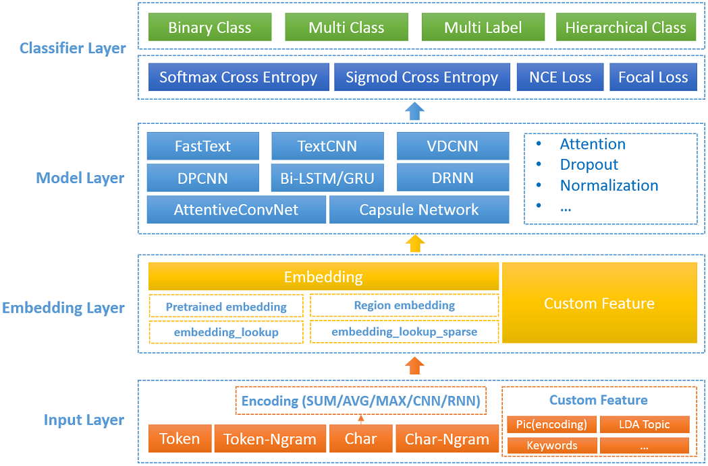
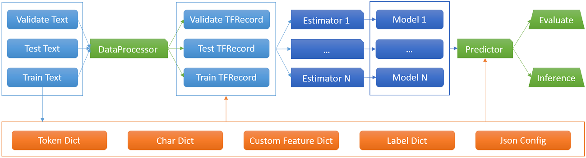
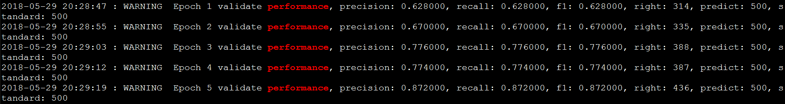
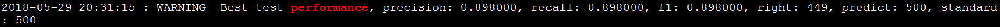

# DeepText-NeuralClassifier：深度学习文本分类工具 #

***Author: Marvinmu, Liqunliu, Felixai, Ranfu, Jamesjtang, Perrypyli, Fandywang***

DeepText 是由腾讯搭建的一个基于 TensorFlow / PyTorch 的深度学习 NLP 公共实验平台，主要涵盖文本分类 （[NeuralClassifier](http://git.code.oa.com/DeepText/NeuralClassifier "深度学习文本分类工具")）、序列标注（[LabelNet](http://git.code.oa.com/DeepText/LabelNet "深度学习序列标注工具")）、语义匹配（[MatchNet](http://git.code.oa.com/DeepText/MatchNet "深度语义匹配框架")）、BERT微调（[BERTFinetuner](http://git.code.oa.com/DeepText/BERTFinetuner "BERT微调工具")）和文本生成（[TextGen](http://git.code.oa.com/DeepText/TextGen "深度学习文本生成工具")）等，本框架广泛应用于文本相关的需求场景中，如广告定向、相关性计算、LookAlike、动态创意、点击率/转化率预估等。
本项目属于文本分类部分，据我们所知，DeepText-NeuralClassifier 是目前业界已知的功能最全面的深度学习文本分类工具。

----------

# 1. DeepText-NeuralClassifier 简介 #
## 1.1 前言 ##
文本分类是 NLP 经典任务之一，使用深度学习进行文本分类是当前的state-of-the-art 方法。一方面深度学习文本分类的新模型和方法在不断涌现，另一方面深度学习开发平台多样，如TensorFlow、PyTorch、Caffe 等，而且这些开发平台也在不断的升级API以增加新功能或特性的支持。当前业界一些文本分类的开源工具比较零散，或代码风格欠佳、或代码执行效率不高、或使用API较旧、或模型覆盖不全、或机制（如Attention、Pre-trained embedding 等）支持不足等，并没有功能全面且方便可用的深度学习文本分类开源工具。

基于以上的原因，我们开发了深度学习文本分类工具 DeepText-NeuralClassifier。将深度学习文本分类模型和机制等集成到一个统一的框架，使用TensorFlow最新的High-level API进行开发，并方便灵活集成更多的模型或方法。DeepText-NeuralClassifier 主要特别如下：

* 支持更多的模型：主流模型如FastText、TextCNN、TextRNN（Bi-GRU/LSTM）等，还支持最新的state-of-the-art模型，如VDCNN、DPCNN、Region Embedding、AttentiveConvNet、DRNN等，并方便支持用户自定义模型结构。
* 支持主流机制，如Attention、Pre-trained embedding等。
* 支持数据输入的多线程加速读取、变长和定长输入、词和字符级输入、自定义输入等。
* 支持多种优化方法，如Adagrad、Adam、FTRL、Momentum、RMSProp、SGD等。
* 支持多种损失函数，如Softmax、NCE Loss、Focal Loss等。
* 支持多种分类任务，如二分类、多分类、层次分类等。
* 支持多模型集成评估和预测。

为了验证 DeepText-NeuralClassifier 实现的有效性，我们对比了业界公开的15个文本分类数据集，数据规模从几千到几百万不等，分类任务包括二分类和多分类，DeepText-NeuralClassifier 对其进行模型复现的结果和论文里的各项指标进行对比均符合预期。

## 1.2 技术架构 ##
### 1.2.1 DeepText-NeuralClassifier 系统框架 ###
DeepText-NeuralClassifier 框架可以抽象为输入层、Embedding层、模型层、分类层四层，如下图所示。
	
### 1.2.2 DeepText-NeuralClassifier 处理流程 ###
DeepText-NeuralClassifier 采用TensorFlow High-level API实现，核心是DataSet、TFRecord、Estimator。DataSet和TFRecord使我们能够结构化且高效的处理输入数据，Estimator使我们可以高效的开发模型并提供灵活的扩展，如下图所示。

# 2. 依赖环境 #
- TensorFlow 1.6+
- Python 3.6+
- Numpy 1.13.3+
- CUDA 9.0.176 (取决于TensorFlow版本)
- CUDNN 7.0.5 (取决于TensorFlow版本)

# 3. Quick Start
我们以char输入的textcnn模型为例，快速了解 DeepText-NeuralClassifier 是如何训练、评估、预测和调优的。

训练：
	
	python train.py conf/textcnn_char.config
运行上面的命令，将会加载配置文件里的输入数据、模型和数据处理方式，并训练和评估。

- 生成模型目录：export\_model
- checkpoint目录: checkpoint
- tfrecord目录：tfrecord
- dict目录：dict
- Log文件：log
- 评估指标输出目录：eval\_dir

export\_model保留每一轮训练的模型。

在log文件中可以grep出每一轮的"validate performance"及最后的"test performance"。

eval\_dir给出的是在validate\_data上表现最好的模型在test\_data上的效果。

训练细节：参考第5.1节。

如果想调优这个模型，可以修改textcnn\_char.config重新训练，详细请参考第8节。

一般的调优思路：

- 模型不收敛：可以调节学习率（一般从0.1开始调节）, 调高batch_size，增加模型复杂度等
- 模型过拟合：可以减小embedding dimension, 使用drop out, 降低模型复杂度，增加正则loss等
- 模型收敛慢：可以减小学习率，降低模型复杂度等
- 模型微调：grid-search搜参

# 4. 输入数据 #
  数据格式（四列）：

    label\t[(token )+]\t[(char )+]\t[(custom_feature )+]
    label：分类的标签，可以是层次的：cate1--cate2--cate3
    token：中文词，对应英文的单词，不需要id化
    char：中文字，对应英文的字符，不需要id化
    custom_feature：自定义，当前支持离散型特征
    说明：label必须有，token, char, custom_feature至少提供一个，没有的需要留空
在训练前会将数据生成为TFRecord格式，通常生成一次TFRecord后可以提供给多个模型使用 ，除非更改数据处理相关的配置，这样的写法也可以方便后续模型集成。

数据文件默认统一采用UTF-8编码，修改请参照util.CHARSET。

DeepText-NeuralClassifier 附带了业界公开的TREC分类数据集，以方便使用者可以快速运行，并观察超参数设置对性能的影响。

TREC是question数据集，分为6个类别，分别为HUM、LOC、DESC、NUM、ENTY、ABBR，数据集规模5952，平均长度为10。

# 5. 训练和评估 #
## 5.1 训练 ##
	python train.py conf/textcnn_char.config

这里以char输入的textcnn为例，全部支持的模型参考5.4节，config参考第8节。

在每一轮，日志里会记录训练和评估的相关信息：
validate performance表示验证集的指标，如果配置了"eval\_train\_data"，则还会输出训练集指标train performance。

在迭代完成之后（num\_epochs），会对测试集进行评估，test performance表示测试集的指标，DeepText会在训练的过程中记录最好的validate performance的模型，并计算对应的test performance。

注意：

- 默认会从checkpoint加载模型，如果从头开始训练一个模型，请确保checkpoint,tfrecord,export_model目录是空的
- textcnn\_char.config是包括textcnn全部可用的配置全集，包括训练、评估、预测

## 5.2 使用pre-trained embedding ##
### 5.2.1 准备pre-trained embedidng文件 ###
使用pre-trained embedding需要额外准备一个embedding文件（如用word2vec训练的embedding），格式是：

    word embedding_dim1 embedding_dim2 ...

DeepText-NeuralClassifier 支持token、char、custom\_feature三类输入，因此最多可以提供三个pre-trained 的embedding文件，对应的config分别是：

- token\_pretrained\_embedding\_file
- char\_pretrained\_embedding\_file
- custom\_feature\_pretrained\_embedding\_file

### 5.2.2 选择pre-trained embedding训练方式 ###
pre-trained embedding在分类模型训练的时候一般分为两类：static、non-static。我们用num\_epochs\_static\_embedding这个config来控制如何使用pre-trained embedding。这个config表示在前几轮让pre-trained embedding静态。比如值取0的话，表示non-static，在第1轮的时候就开始随其他参数一起训练；取2，表示在前2轮保持pre-trained embedding不更新，只更新上层参数，在第3轮的时候开始随其他参数一起训练；取超过迭代最大轮数的值，则可以实现static功能。

## 5.3 评估 ##
虽然在train.py训练的时候会对验证集和测试集进行评估，但是有时候我们想使用某个指定的模型，对某个文件进行评估，脚本如下：

    python evaluate.py conf/textcnn_char.config

主要需要关注配置：

    "eval": {                                                                   
        "text_file": "data/trec_validate.txt",
        "threshold": 0.0,
        "eval_dir": "eval_dir",  
        "is_flat": true
    }
    "predict": {
        "model_tag": "serve",
        "model_dirs": ["export_model/1527501251", "export_model/1527501256"],
        "model_weights": [0.6, 0.4] 
    }

text\_file：评估的文件

is\_flat：label是否是层次的，当为false时，表示进行层次分类的评估，会将label按照"--"分隔，计算多个层级的指标

model\_dirs: 可以提供多个模型，采用概率相加的ensemble方式。注意多个模型的tfrecord应该一致

model\_weights: model\dirs模型线性加权的权重

## 5.4 支持的模型概览 ##
当前支持的模型如下：

<table>
<tr align="middle"><th><th>char<th>token<th>自定义输入<th>pre-trained embedding<th>定长输入<th>变长输入<th>ngram<th>attention
<tr align="middle"><td>FastText <td>yes<td>yes<td>yes<td>yes<td>yes<td>yes<td>yes<td>no
<tr align="middle"><td>TextCNN <td>yes<td>yes<td>no<td>yes<td>yes<td>no<td>no<td>no
<tr align="middle"><td>TextRNN <td>yes<td>yes<td>no<td>yes<td>yes<td>no<td>no<td>yes
<tr align="middle"><td>VDCNN <td>yes<td>yes<td>no<td>yes<td>yes<td>no<td>no<td>no
<tr align="middle"><td>DPCNN <td>yes<td>yes<td>no<td>yes<td>yes<td>no<td>no<td>no
<tr align="middle"><td>Region Embedding <td>yes<td>yes<td>no<td>yes<td>yes<td>no<td>no<td>no
<tr align="middle"><td>AttentiveConvNet <td>yes<td>yes<td>no<td>yes<td>yes<td>no<td>no<td>yes
<tr align="middle"><td>DRNN <td>yes<td>yes<td>no<td>yes<td>yes<td>no<td>no<td>no
</table>
以上并未支持的功能，用户可自定义开发，具体参考第7节。

每个模型使用的config并不一样，我们为每个模型（包括机制）提供了推荐的config配置(更多配置用户可自定义)，可以大大简化工具的使用。

	fasttext_token_char.config
	fasttext_token_char_custom_feature.config
	fasttext_token_char_tokenbigram_chartrigram.config
	textcnn_char.config
	textcnn_token.config
	bilstm_token.config
	bilstm_token_attention.config
	bilstm_char.config
	bilstm_char_attention.config
	bigru_token.config
	bigru_token_attention.config
	bigru_char.config
	bigru_char_attention.config
	vdcnn_char.config
	dpcnn_token.config
	dpcnn_char.config
	region_embedding_wc_token.config
	region_embedding_cw_token.config
	attentiveconvnet_light_token.config
	attentiveconvnet_advanced_token.config
	drnn_token.config

# 6. 预测 #
## 6.1 离线预测 ##
同5.3评估模块evaluate.py，代码里封装调用预测模块predict.py，预测模块支持单模型预测和多模型集成预测（默认采用预测概率相加的方式）。

## 6.2 在线预测（模型部署） ##
离线训练的模型部署到线上，需要搭建一个在线预测（inference）RPC服务。一般有两种提供服务方式，一种是用python封装predict.py，一种是使用TF Serving。此部分目前需要使用者自己开发（后面DeepText会开放服务代码）。

# 7. 自定义开发 #
DeepText-NeuralClassifier 良好的架构设计可以方便开发者进行自定义开发。
## 7.1 新增模型 ##
支持开发者灵活添加自定义模型，需要改动的模块：

- 新增一个模型定义文件，参考model目录下的模型文件（如text_cnn.py），继承Estimator
- train.py里增加import
- config.json里增加新模型相关的config（如果有必要）

## 7.2 修改模型网络结构 ##
请修改model目录下的模型文件进行即可。

## 7.3 修改embedding ##
参考model/embedding_layer文件。

## 7.4 修改输入处理方式 ##
参考data\_processor.py。

# 8. Config介绍 #
所有用到的超参数，通过json格式的config指定，参考config.json。
全部config我们按照功能划分为12个模块，分别是：

- 数据相关
- 特征相关
- 定长输入相关
- 变长输入相关
- 训练相关
- 优化器相关
- Embedding相关
- 模型相关
- 日志相关
- 模型特有参数
- 评估相关
- 预测相关

以下是全部config（config.json）及其注释：

**数据相关Configs：**

	MODULE_NAME = "data"
	# 训练集
	"train_text_file": "data/trec_train.txt",
	"comment": "Input train text file."
	           "Shuffle your train data at first"
	           "Text format: label\t[(token )+]\t[(char )+]\t"
	           "[(custom_feature )+]. Label could be flattened or "
	           "hierarchical which is separated by '--'."
	
	# 验证集
	"validate_text_file": "data/trec_validate.txt",
	"comment": "Input validate text file."
	           "Text format: label\t[(token )+]\t[(char )+]\t"
	           "[(custom_feature )+]. Label could be flattened or "
	           "hierarchical which is separated by '--'."

	# 测试集
	"test_text_file": "data/trec_test.txt",
	"comment": "Input test text file."
	           "Text format: label\t[(token )+]\t[(char )+]\t"
	           "[(custom_feature )+]. Label could be flattened or "
	           "hierarchical which is separated by '--'."
	
	# 生成的tfrecord目录
	"tfrecord_dir": "tfrecord"
	"comment": "Directory to save tfrecord."
	
	# 生成的词典目录
	"dict_dir": "dict"
	"comment": "Directory to save dicts and "
	           "configs of module data_processor."
	
	# shuffle buffer的大小，最好设置为不比训练集样本数少
	"shuffle_buffer": 1000000
	"comment": "Shuffle buffer used by tf.dataset, the bigger the "
	           "better. Shuffle your train data at first"

**特征相关Configs：**
	
	MODULE_NAME = "feature_common"
	# 使用输入序列的类型，可以是token（词）、char（字符）、custom_feature（自定义）等
	"feature_names": "token"
	"comment": "Feature names to use, separated by comma."
	           "candidate is in DataProcessor.dict_names"
	
	# 最小的token截断个数
	"min_token_count": 2
	"comment": "Min count of token."
	
	# 最小的char截断个数
	"min_char_count": 2
	"comment": "Min count of char."
	
	# token内部的char的最小个数
	"min_char_count_in_token":0
	"comment": "Min char count in token"
	
	# token词典的最大截断个数
	"max_token_dict_size": 1000000
	"comment": "Max dict size of token."
	
	# char词典的最大截断个数
	"max_char_dict_size": 150000
	"comment": "Max dict size of char."
	
	# token内部的char的词典最大截断个数
	"max_char_in_token_dict_size": 1000000
	"comment": "max dict size of char in tokens"
	
	# token的pre-trained embedding文件
	"token_pretrained_embedding_file": ""
	"comment": "Pretrained token embedding file"
	
	# char的pre-trained embedding文件
	"char_pretrained_embedding_file":""
	"comment": "Pretrained char embedding file"

**定长输入相关Configs：**

	MODULE_NAME = "fixed_len_feature"
	# token的最长个数
	"max_token_sequence_length": 256
	"comment": "Max length of token per example."
	
	# token在头部增加padding的个数，此功能在一些卷积网络、或region embedding网络中可能会提升效果
	"token_padding_begin": 0
	"comment": "Padding size at the begin of the token list."
	
	# token在尾部增加padding的个数，此功能在一些卷积网络、或region embedding网络中可能会提升效果
	"token_padding_end": 0
	"comment": "Padding size at the end of the token list."	
	
	# 每个token里的char最大长度
	"max_char_length_per_token": 4
	"comment": "Max char length per token"
	
	# 每个token里的char头部的padding个数
	"char_padding_per_token_begin": 0
	"comment": "The number of paddings at the begin of the char in each token"
	
	# 每个token里的char尾部的padding个数
	"char_padding_per_token_end": 0
	"comment": "The number of paddings at the end of the char in each token"	
	
	# char输入的最长个数
	"max_char_sequence_length": 512
	"comment": "Max length of char per example."
	
	# char在头部增加padding的个数，此功能在一些卷积网络、或region embedding网络中可能会提升效果
	"char_padding_begin": 0
	"comment": "Padding size at the begin of the char list."
	
	# char在尾部增加padding的个数，此功能在一些卷积网络、或region embedding网络中可能会提升效果
	"char_padding_end": 0
	"comment": "Padding size at the end of the char list."

**变长输入相关Configs：**

	MODULE_NAME = "var_len_feature"
	# token的最长个数（变长输入）
	"max_var_token_length": -1
	"comment": "Max length of var token per example."
	           "-1 mean unlimited."
	
	# char的最长个数（变长输入）
	"max_var_char_length": -1
	"comment": "Max length of var char per example."
	           "-1 mean unlimited."
	
	# token ngram计算个数，如2，比表示程序将自动计算bigram并将其作为输入
	"token_ngram": 1
	"comment": "Ngram of token."
	
	# char ngram计算个数，如2，比表示程序将自动计算bigram并将其作为输入
	"char_ngram": 1
	"comment": "Ngram of char."
	
	# 最小的token ngram截断个数
	"min_token_ngram_count": 2
	"comment": "Min token ngram count."
	
	# 最小的char ngram截断个数
	"min_char_ngram_count": 2
	"comment": "Min char ngram count."
	
	# 最大的token ngram词典规模
	"max_token_ngram_dict_size": 1000000
	"comment": "Max dict size of token ngram."
	
	# 最大的char ngram词典规模
	"max_char_ngram_dict_size": 2000000
	"comment": "Max dict size of char ngram."
	
	# custom_feature的最长个数（变长输入）
	"max_var_custom_feature_length": -1
	"comment": "Max length of var custom feature per example."
	           "-1 mean unlimited."
	
	# custom_feature的最小截断个数
	"min_custom_feature_count": 2
	"comment": "Min count of custom feature."
	
	# custom_feature的最大词典规模
	"max_custom_feature_dict_size": 10000
	"comment": "Max dict size of custom feature."
	
	# custom_feature的pre-trained embedding文件
	"custom_feature_pretrained_embedding_file": ""
	"comment": "Pretrained custom feature embedding file"

**训练相关Configs：**

	MODULE_NAME = "train"
	# batch size
	"batch_size": 128
	"comment": "Training mini batch size."
	
	# 对训练集评估指标时，此时的batch size
	"predict_batch_size": 4096
	"comment": "Predicting mini batch size. The bigger, the faster."
	            "But limited by memory size. "
	            "For TextCNN this value should be set smaller"
	
	# 是否在训练过程中对训练集进行评估
	"eval_train_data": false
	"comment": "Whether to eval train data at every epoch"
	
	# 学习率
	"learning_rate": 0.001
	"comment": "Learning rate for training."
	
	# 最大的迭代轮数
	"num_epochs": 4
	"comment": "Number of training epochs."
	
	# 使用静态embedding的轮数
	"num_epochs_static_embedding": 0
	"comment": "Number of training epochs that embedding will not be "
	           "updated. If bigger than num_epochs, then embedding "
	           "will remain as it is first initialized. Usually used "
	           "when embedding is initialized with pretrained "
	           "embedding"
	
	# 衰减的steps数
	"decay_steps": 1000
	"comment": "How many steps before decay learning rate."
	
	# 衰减率
	"decay_rate": 0.65
	"comment": "Rate of decay for learning rate."
	
	# 梯度截断
	"clip_gradients": 5.0
	"comment": "Clip absolute value gradient bigger than threshold."
	
	# l2正则化参数
	"l2_lambda": 0.0001
	"comment": "lambda value of l2 norm."
	
	# 损失函数类型
	"loss_type": "Softmax"
	"comment": "Loss type. Candidate: Softmax, NCE, SoftmaxFocalLoss"
	
	# 采样器，仅当损失函数是NCE时候使用
	"sampler": "fixed"
	"comment": "If loss type is NCE, sampler is needed. Candidate: "
	           "fixed, log, learned, uniform."
	           "More details in tensorflow api doc: "
	           "https://www.tensorflow.org/api_guides/"
	           "python/nn#Candidate_Sampling"
	
	# 采样的个数，仅当损失函数是NCE时候使用
	"num_sampled": 5
	"comment": "If loss type is NCE, need to sample negative labels."
	
	# 隐层的dropout
	"hidden_layer_dropout_keep_prob": 0.5
	"comment": "Dropout prob of hidden layer."
	
	# 使用哪个/哪些gpu，如‘0,1’，则使用第0和1两块GPU卡
	"visible_device_list": "0"
	"comment": "Which gpu to use, separated by comma."
	
	# 是否开启timeline
	"track_timeline": false
	"comment": "Whether to track the timeline."

**优化器相关Configs：**

	MODULE_NAME = "optimizer"
	# 优化器类型
	"optimizer": "Adam"
	"comment": "Optimizer of loss. Candidate: "
	           "Adagrad, Adam, Ftrl, Momentum, RMSProp, SGD, Adadelta."
	
	# adadelta优化器的衰减率
	"adadelta_decay_rate": 0.95
	"comment": "Decay rate of adadelta, useful when optimizer is "
	           "Adadelta"
	
	# adadelta优化器的epsilon
	"adadelta_epsilon": 1e-8
	"comment": "Epsilon of adadelta, useful when optimizer is "
	                      "Adadelta"

**Embedding相关Configs：**

	MODULE_NAME = "embedding_layer"
	# embedding维度
	"embedding_dimension": 128
	"comment": "Dimension of word embedding."
	
	# embedding初始化方式
	VALID_EMBEDDING_INITIALIZER = ["uniform", "normal"]
	"embedding_initializer": "uniform"
	"comment": "Embedding_initializer can be: %s." % ",".join(
	           VALID_EMBEDDING_INITIALIZER)
	
	# embedding uniform初始化时候的bound
	"embedding_uniform_bound": 0
	"comment": "If embedding_initializer is uniform, this param will be "
	           "used as bound. e.g."
	           "[-embedding_uniform_bound,embedding_uniform_bound]."
	           "If embedding_uniform_bound is 0, default bound will be"
	           "used, which is 1.0/pow(embedding_dimension, 0.5)"
	
	# embedding随机初始化的标准差
	"embedding_random_stddev": 0.01
	"comment": "If embedding_initializer is random, this param will be "
	           "used as stddev."
	
	# embedding层的dropout
	"embedding_dropout_keep_prob": 1
	"comment": "Dropout prob of embedding."

**模型相关Configs：**

	MODULE_NAME = "model_common"
	# 模型类型
	VALID_MODEL_TYPE = ["FastText", "TextCNN", "TextRNN", "TextVDCNN", "RegionEmbedding", "AttentiveConvNet"]
	"model_type": "FastText"
	"comment": "Model type can be: %s" % ",".join(VALID_MODEL_TYPE)
	
	# checkpoint路径
	"checkpoint_dir": "checkpoint"
	"comment": "Path to save checkpoint for estimator"
	
	# 训练生成的模型保存路径
	"export_model_dir": "export_model"
	"comment": "Path to export the final model"
	
	# 是否使用attention，针对TextRNN模型
	"use_self_attention": false
	"comment":  "Whether to use self attention. Can be use in TextRNN."
	
	# attention维度
	"attention_dimension": 32
	"comment": "Dimension of attention."
	
	# 激活函数选择
	VALID_ACTIVATION_TYPE = ["relu", "sigmoid", "tanh", "none"]
	"activation": "none"
	"comment": "Activation func at last layer can be: %s" % ",".join(
	           VALID_ACTIVATION_TYPE)

**LOG相关Configs：**

	MODULE_NAME = "log"
	# log目录
	"logger_file": "log"
	"comment": "Log file."
	
	# log level
	"log_level": "warn"
	"comment": "Log level of logging and tf.logging, "
	           "candidate: debug, info, warn, error."
	           "Since tf.estimator's info log will cover some train "
	           "log, we set default log level warn and log level in "
	           "this project is equal or greater than warn."

**FastText相关Configs：**

**TextCNN相关Configs：**

	MODULE_NAME = "TextCNN"
	# filter大小
	"filter_sizes": "[1,2,3,4,5,6,7]"
	"comment": "Comma-separated filter sizes."
	
	# filter个数
	"num_filters": 256
	"comment": "Number of filters per filter size."

**TextRNN相关Configs：**

	MODULE_NAME = "TextRNN"
	# RNN维度
	"rnn_dimension": 128
	"comment": "Dimension of rnn."
	
	VALID_CELL_TYPE = ["gru", "lstm"]
	# 使用哪种RNN cell
	"cell_type": "lstm"
	"comment": "Rnn cell type can be: %s" % ",".join(VALID_CELL_TYPE)
	
	# 是否使用双向RNN
	"use_bidirectional": true
	"comment": "If true, will use bidirectional rnn. "
	           "Else, use one way"

**VDCNN相关Configs：**

	MODULE_NAME = "TextVDCNN"
	# VDCNN的网络深度，可选9, 17, 29, 49
	"vdcnn_depth": 9
	"comment": "depth of vdcnn, can be 9, 17, 29, 49."

**RegionEmbedding相关Configs：**

	MODULE_NAME = "RegionEmbedding"
	# region embedding的模式
	"region_embedding_mode": "WC"	
	"comment": "Can be WC,CW;"	
	           "WC : Word-Context Region Embedding, "
	           "CW : Context-Word Region Embedding"
	
	# region size
	"region_size": 9
	"comment": "region size, must be odd number."
	           "region size means "
	           "how many tokens/chars one region covers"

**AttentiveConvNet相关Configs：**

	MODULE_NAME = "AttentiveConvNet"
	# attentive width 
	"attentive_width": 3 
	"comment": "attentive_width, must be odd"
	
	# attentive hidden size
	"attentive_hidden_size": 500
	"comment": "attentive_hidden_size"
	
	# attentive version
	"attentive_version": "light",
	"comment": "attentive_version: light, advanced"

**评估相关Configs：**
	
	MODULE_NAME = "eval"
	# 评估时候使用的概率阈值，当低于或等于这个阈值的时候，不会被评估
	"threshold": 0
	"comment": "If max predict prob is less than or equal to threshold, "
	           "this example will not counted in precision calculation."

	# 存放评估结果的目录
	"eval_dir": "eval_dir"
	"comment": "Path to output the detail performance on test set"
	
	# label是否是展开的，如果是false，则表示层次分类，此时计算评估指标将按照层次方式
	"is_flat": true
	"comment": "Label is flat or not"
	
	# eval时候的batch size
	"batch_size": 128
	"comment": "Batch size of evaluation"

**预测相关Configs：**
	
	MODULE_NAME = "predict"
	# 模型的tag，加载模型使用，可以是"train","serve","gpu","tpu",etc.
	"model_tag": "serve",
	"comment": "model tag added by user"
	
	# 模型目录
	"model_dirs": "["export_model/1527501251", "export_model/1527501256"]"
	"comment": "model dirs"
	
	# 模型权重
	"model_weights": "[0.6, 0.4]"
	"comment": "model weights"

# 9. TODO #
- 数据输入
	- 支持图片特征和多模态
	- 支持浮点型自定义特征
- 模型相关
	- 支持Learning Structured Representation、Capsule Network等
	- 更多Attention机制
- 损失函数
	- 支持层次损失函数（如Recursive Regularization）
- 分类任务
	- 支持自顶向下的层次化分类
- 在线部署
	- 开放部署Server代码

# 10. 致谢 #
实现过程中参考了业界一些公开的代码或开源工具，包括超参数设置，或者部分引用代码，这里一并列出表示感谢。

1. https://github.com/yinwenpeng/Attentive_Convolution
2. https://github.com/text-representation/local-context-unit
3. https://github.com/brightmart/text_classification
4. https://github.com/zonetrooper32/VDCNN
5. https://github.com/NLPLearn/QANet

# 附录1 公开数据集评测 #
为了验证代码实现的正确性，我们复现了论文里的模型和训练方式，并在公开数据集上进行评测，结果符合预期，在部分数据集上 DeepText-NeuralClassifier 的效果更佳。

<table>
<tr align="middle"><th>TextCNN[Kim, Yoon,2014]<th>类别个数<th>数据集规模<th>平均长度<th>词表大小(w)<th>TextCNN-rand<th>TextCNN-static<th>TextCNN-non-static
<tr align="middle"><td>Movie Reviews <td>2<td>10662<td>20<td>1<td>75.4(-0.7)<td>80.6(-0.4)<td>80.7(-0.8)
<tr align="middle"><td>SST-1 <td>5<td>11855<td>18<td>1<td>46.4(+1.4)<td>47.0(+1.5)<td>50.0(+2.0)
<tr align="middle"><td>SST-2 <td>2<td>9613<td>19<td>1<td>84.5(+1.8)<td>86.7(-0.1)<td>87.5(+0.3)
<tr align="middle"><td>Subj <td>2<td>10000<td>23<td>1<td>89.7(+0.1)<td>93.1(+0.1)<td>93.0(-0.4)
<tr align="middle"><td>TREC <td>6<td>5952<td>10<td>0.6<td>89.8(-1.4)<td>92.6(-0.2)<td>93.8(+0.2)
<tr align="middle"><td>CR <td>2<td>3775<td>19<td>0.37<td>78.8(-1.0)<td>83.5(-1.2)<td>84.5(+0.2)
<tr align="middle"><td>MPQA <td>2<td>10606<td>3<td>1<td>84.2(+0.8)<td>89.5(-0.1)<td>89.4(-0.1)
</table>

<table>
<tr align="middle"><th>FastText[Joulin, Armand, et al, 2016]<th>类别个数<th>数据集规模<th>平均长度<th>词表大小(w)<th>FastText(h=10)<th>FastText(h=10,bigram)
<tr align="middle"><td>AG's News<td>4<td>127,600<td>43<td>9<td>91.9(+0.4)<td>92.9(+0.4)
<tr align="middle"><td>Sogou News<td>5<td>510,000<td>577<td>36<td>94.5(+0.6)<td>96.8(+0.0)
<tr align="middle"><td>DBPedia<td>14<td>630,000<td>54<td>52<td>98.2(+0.1)<td>98.7(+0.1)
<tr align="middle"><td>Yelp Review Polarity<td>2<td>598,000<td>156<td>56<td>94.1(+0.3)<td>95.9(+0.2)
<tr align="middle"><td>Yelp Review Full<td>5<td>700,000<td>157<td>51<td>60.5(+0.1)<td>63.4(-0.5)
<tr align="middle"><td>Yahoo! Answers<td>10<td>1,460,000<td>111<td>190<td>72.6(+0.6)<td>73.4(+1.1)
<tr align="middle"><td>Amazon Review Full<td>5<td>3,650,000<td>94<td>140<td>55.1(-0.7)<td>60.4(+0.0)
<tr align="middle"><td>Amazon Review Polarity<td>2<td>4,000,000<td>92<td>150<td>91.3(+0.1)<td>94.8(+0.2)
</table>

# 附录2 业务数据集评测 #
我们用 DeepText-NeuralClassifier 在实际业务场景进行了实验，尤其是区分更细粒度的类目，超出现有的Baseline效果。这里重点介绍APP分类、电商分类、资讯分类的实验结果。
## APP场景 ##
APP场景的类目体系分为三级，根据业界主流的应用商店，并结合广告主的需求综合制定，共计340+类目节点。数据集采用人工标注加规则生成的方式，规模约30万。
<table>
<tr align="middle"><td rowspan="2"><strong>Model\Performance<td colspan="3"><strong>一级类目<td colspan="3"><strong>二级类目<td colspan="3"><strong>三级类目
<tr align="middle"><td>Precision<td>Recall<td>F1-score<td>Precision<td>Recall<td>F1-score<td>Precision<td>Recall<td>F1-score
<tr align="middle"><td>Baseline1-TextMiner-MaxEnt<td>94.90%<td>94.90%<td>94.90%<td>88.93%<td>89.36%<td>89.14%<td>73.51%<td>85.64%<td>79.11%
<tr align="middle"><td>Baseline2-TextMiner-FastText<td>95.19%<td>95.19%<td>95.19%<td>89.27%<td>89.80%<td>89.54%<td>73.13%<td>83.31%<td>77.89%
<tr align="middle"><td>TextCNN-Token<td>96.94%<td>96.94%<td>96.94%<td>93.13%<td>93.33%<td>93.23%<td>88.06%<td>87.38%<td>87.72%
<tr align="middle"><td>TextCNN-Char<td>96.90%<td>96.90%<td>96.90%<td>92.89%<td>93.11%<td>93.00%<td>88.18%<td>87.17%<td>87.67%
<tr align="middle"><td>TextCNN-Token-Word2vec<td>96.96%<td>96.96%<td>96.96%<td>93.11%<td>93.33%<td>93.22%<td>88.30%<td>87.68%<td>87.99%
<tr align="middle"><td>TextCNN-Token-CWE<td>96.90%<td>96.90%<td>96.90%<td>93.10%<td>93.27%<td>93.18%<td>88.29%<td>87.55%<td>87.92%
<tr align="middle"><td>LightAttentiveConvolution<td>96.85%<td>96.85%<td>96.85%<td>92.94%<td>93.14%<td>93.04%<td>88.35%<td>87.60%<td>87.97%
<tr align="middle"><td>LightAttentiveConvolution-CWE<td>97.02%<td>97.02%<td>97.02%<td>93.30%<td>93.50%<td>93.40%<td>88.91%<td>88.25%<td>88.58%
<tr align="middle"><td>BiLSTM-Token<td>96.39%<td>96.39%<td>96.39%<td>91.38%<td>91.72%<td>91.55%<td>85.68%<td>85.28%<td>85.48%
<tr align="middle"><td>BiGRU-Token<td>96.58%<td>96.58%<td>96.58%<td>91.95%<td>92.10%<td>92.02%<td>87.34%<td>86.18%<td>86.76%
<tr align="middle"><td>BiLSTM-Token-Attention<td>96.83%<td>96.83%<td>96.83%<td>92.80%<td>93.03%<td>92.92%<td>87.27%<td>87.37%<td>87.32%
<tr align="middle"><td>BiGRU-Token-Attention<td>96.97%<td>96.97%<td>96.97%<td>92.97%<td>93.21%<td>93.09%<td>87.88%<td>87.43%<td>87.66%
<tr align="middle"><td>BiGRU-Token-Attention-Word2vec<td>96.86%<td>96.86%<td>96.86%<td>92.83%<td>93.08%<td>92.96%<td>87.25%<td>87.66%<td>87.46%
<tr align="middle"><td>BiGRU-Token-Attention-CWE<td>96.81%<td>96.81%<td>96.81%<td>92.69%<td>92.96%<td>92.82%<td>87.05%<td>86.45%<td>86.75%
<tr align="middle"><td>BiLSTM-Token-Attention-Word2vec<td>96.80%<td>96.80%<td>96.80%<td>92.52%<td>92.79%<td>92.65%<td>86.83%<td>86.38%<td>86.61%
<tr align="middle"><td>BiLSTM-Token-Attention-CWE<td>96.77%<td>96.77%<td>96.77%<td>92.53%<td>92.69%<td>92.61%<td>86.66%<td>86.56%<td>86.61%
<tr align="middle"><td>BiLSTM-Char<td>95.90%<td>95.90%<td>95.90%<td>90.40%<td>90.73%<td>90.57%<td>83.84%<td>84.00%<td>83.92%
<tr align="middle"><td>BiLSTM-Char-Attention<td>96.32%<td>96.32%<td>96.32%<td>91.95%<td>92.16%<td>92.06%<td>86.65%<td>86.24%<td>86.45%
<tr align="middle"><td>BiGRU-Char<td>96.24%<td>96.24%<td>96.24%<td>91.33%<td>91.63%<td>91.47%<td>84.80%<td>84.68%<td>84.74%
<tr align="middle"><td>BiGRU-Char-Attention<td>96.70%<td>96.70%<td>96.70%<td>92.38%<td>92.61%<td>92.49%<td>86.61%<td>87.07%<td>86.84%
<tr align="middle"><td>FastText(Token-Bigram)<td>94.75%<td>94.75%<td>94.75%<td>88.79%<td>88.79%<td>88.79%<td>81.53%<td>80.58%<td>81.05%
<tr align="middle"><td>FastText(Token-Trigram)<td>95.16%<td>95.16%<td>95.16%<td>89.21%<td>89.64%<td>89.42%<td>83.10%<td>81.57%<td>82.33%
<tr align="middle"><td>VDCNN(9)-Char<td>95.27%<td>95.27%<td>95.27%<td>90.11%<td>90.32%<td>90.22%<td>82.99%<td>82.42%<td>82.70%
<tr align="middle"><td>VDCNN(29)-Char<td>92.37%<td>92.37%<td>92.37%<td>84.81%<td>85.16%<td>92.37%<td>73.75%<td>74.65%<td>74.20%
<tr align="middle"><td>RegionEmbedding（WC原始代码seq_len=1024）<td>96.14%<td>96.14%<td>96.14%<td>91.32%<td>91.24%<td>91.28%<td>86.75%<td>85.37%<td>86.05%
<tr align="middle"><td>RegionEmbedding（CW原始代码seq_len=1024）<td>96.03%<td>96.03%<td>96.03%<td>90.96%<td>90.78%<td>90.87%<td>86.16%<td>84.66%<td>85.40%
<tr align="middle"><td>RegionEmbedding（multi-region原始代码seq_len=1024）<td>96.18%<td>96.18%<td>96.18%<td>91.48%<td>91.30%<td>91.39%<td>86.78%<td>85.16%<td>85.96%
<tr align="middle"><td>RegionEmbedding(WC.seq_len=256)<td>96.08%<td>96.08%<td>96.08%<td>91.11%<td>91.41%<td>91.26%<td>84.43%<td>84.06%<td>84.24%
<tr align="middle"><td>RegionEmbedding(WC.seq_len=512)<td>96.19%<td>96.19%<td>96.19%<td>91.11%<td>91.32%<td>91.22%<td>85.31%<td>84.12%<td>84.71%
<tr align="middle"><td>RegionEmbedding(WC.seq_len=1024)<td>96.14%<td>96.14%<td>96.14%<td>91.50%<td>91.70%<td>91.60%<td>86.23%<td>84.27%<td>85.24%
<tr align="middle"><td>RegionEmbedding(CW.seq_len=256)<td>96.01%<td>96.01%<td>96.01%<td>90.98%<td>91.18%<td>91.08%<td>85.46%<td>84.33%<td>84.89%
<tr align="middle"><td>RegionEmbedding(CW.seq_len=512)<td>95.81%<td>95.81%<td>95.81%<td>90.90%<td>91.18%<td>91.04%<td>85.72%<td>83.63%<td>84.66%
<tr align="middle"><td>RegionEmbedding(CW.seq_len=1024)<td>96.00%<td>96.00%<td>96.00%<td>91.45%<td>91.58%<td>91.51%<td>85.97%<td>84.32%<td>85.14%
<tr align="middle"><td>RegionEmbedding(WC)+Word2vec<td>96.10%<td>96.10%<td>96.10%<td>91.22%<td>91.31%<td>91.26%<td>85.60%<td>84.56%<td>85.08%
<tr align="middle"><td>RegionEmbedding(CW)+Word2vec<td>96.04%<td>96.04%<td>96.04%<td>91.10%<td>91.28%<td>91.19%<td>85.24%<td>83.76%<td>84.49%
<tr align="middle"><td>RegionEmbedding(WC)-CWE<td>96.05%<td>96.05%<td>96.05%<td>90.92%<td>91.11%<td>91.02%<td>85.09%<td>84.00%<td>84.54%
<tr align="middle"><td>RegionEmbedding(CW)-CWE<td>96.03%<td>96.03%<td>96.03%<td>90.81%<td>91.07%<td>90.94%<td>85.63%<td>83.21%<td>84.40%
<tr align="middle"><td>RegionEmbedding(WC.seq_len=256)+TextCNN（拼接wordembedding）<td>97.31%<td>97.31%<td>97.31%<td>93.83%<td>94.04%<td>93.94%<td>88.68%<td>88.75%<td>88.71%
<tr align="middle"><td>RegionEmbedding(WC.seq_len=512)+TextCNN（拼接wordembedding）<td>97.49%<td>97.49%<td>97.49%<td>94.22%<td>94.47%<td>94.35%<td>89.86%<td>88.82%<td>89.34%
<tr align="middle"><td>RegionEmbedding(WC.seq_len=1024)+TextCNN（拼接wordembedding）<td>97.40%<td>97.40%<td>97.40%<td>94.30%<td>94.37%<td>94.34%<td>89.97%<td>89.24%<td>89.60%
<tr align="middle"><td>RegionEmbedding(CW)+TextCNN（替换wordembedding）<td>96.53%<td>96.53%<td>96.53%<td>92.67%<td>92.76%<td>92.72%<td>87.06%<td>85.48%<td>86.26%
<tr align="middle"><td>RegionEmbedding(CW.seq_len=256)+TextCNN（拼接wordembedding)<td>97.47%<td>97.47%<td>97.47%<td>94.04%<td>94.14%<td>94.09%<td>89.32%<td>88.60%<td>88.96%
<tr align="middle"><td>RegionEmbedding(CW.seq_len=512)+TextCNN（拼接wordembedding）<td>97.50%<td>97.50%<td>97.50%<td>94.34%<td>94.58%<td>94.46%<td><strong>90.37%<td><strong>89.29%<td><strong>89.83%
<tr align="middle"><td>RegionEmbedding(CW.seq_len=1024)+TextCNN（拼接wordembedding）<td>97.46%<td>97.46%<td>97.46%<td>94.27%<td>94.38%<td>94.32%<td>89.79%<td>89.36%<td>89.57%
<tr align="middle"><td>RegionEmbedding(WC)+TextCNN（拼接）+Word2vec<td>97.46%<td>97.46%<td>97.46%<td>94.20%<td>94.37%<td>94.28%<td>89.07%<td>89.75%<td>89.41%
<tr align="middle"><td>RegionEmbedding(CW)+TextCNN（拼接）+Word2vec<td>97.49%<td>97.49%<td>97.49%<td>94.35%<td>94.55%<td>94.45%<td>89.28%<td>89.40%<td>89.34%
<tr align="middle"><td>RegionEmbedding(WC)+TextCNN（拼接）-CWE<td><strong>97.56%<td><strong>97.56%<td><strong>97.56%<td><strong>94.47%<td><strong>94.52%<td><strong>94.49%<td>90.25%<td>89.11%<td>89.68%
<tr align="middle"><td>RegionEmbedding(CW)+TextCNN（拼接）-CWE<td>97.54%<td>97.54%<td>97.54%<td>94.22%<td>94.40%<td>94.31%<td>89.78%<td>89.79%<td>89.79%
</table>
注：TextMiner是自研自顶向下层次分类工具

## 电商场景 ##
电商类目体系分为三级，根据业界主流的电商体系，并结合广告主的需求综合制定，共计130+类目节点。数据集采用自动爬取的方式构建，规模约2000万。
<table>
<tr align="middle"><td rowspan="2"><strong>Model\Performance<td colspan="3"><strong>一级类目<td colspan="3"><strong>二级类目<td colspan="3"><strong>三级类目
<tr align="middle"><td>Precision<td>Recall<td>F1-score<td>Precision<td>Recall<td>F1-score<td>Precision<td>Recall<td>F1-score
<tr align="middle"><td>Baseline-TextMiner-FastText<td><strong>94.98%<td><strong>94.91%<td><strong>94.94%<td><strong>91.50%<td><strong>91.43%<td><strong>91.46%<td>86.35%<td>89.65%<td>87.97%
<tr align="middle"><td>FastText(Token-TokenNgram)<td>93.91%<td>93.91%<td>93.91%<td>87.51%<td>87.51%<td>87.51%<td>84.87%<td>85.59%<td>85.23%
<tr align="middle"><td>FastText(Token-TokenNgram-custom_feature(lda))<td>93.81%<td>93.81%<td>93.81%<td>87.65%<td>87.65%<td>87.65%<td>85.02%<td>85.66%<td>85.34%
<tr align="middle"><td>CNN-Char<td>93.65%<td>93.65%<td>93.65%<td>89.39%<td>89.39%<td>89.39%<td>87.18%<td>87.32%<td>87.25%
<tr align="middle"><td>CNN-Token<td>94.39%<td>94.39%<td>94.39%<td>90.13%<td>90.13%<td>90.13%<td>87.98%<td>87.96%<td>87.97%
<tr align="middle"><td>CNN-Token-Word2vec<td>94.41%<td>94.41%<td>94.41%<td>90.91%<td>90.91%<td>90.91%<td>88.58%<td>88.33%<td>88.46%
<tr align="middle"><td>CNN-Token-CWE<td>94.54%<td>94.54%<td>94.54%<td>90.36%<td>90.36%<td>90.36%<td>88.08%<td>88.00%<td>88.04%
<tr align="middle"><td>BiLSTM-Token<td>93.12%<td>93.12%<td>93.12%<td>87.35%<td>87.35%<td>87.35%<td>84.69%<td>85.08%<td>84.89%
<tr align="middle"><td>BiLSTM-Token-Attention<td>93.50%<td>93.50%<td>93.50%<td>89.33%<td>89.33%<td>89.33%<td>87.14%<td>87.25%<td>87.19%
<tr align="middle"><td>BiLSTM-Token-Attention-Word2vec<td>94.09%<td>94.09%<td>94.09%<td>89.04%<td>89.04%<td>89.04%<td>86.73%<td>86.98%<td>86.85%
<tr align="middle"><td>BiLSTM-Token-Attention-CWE<td>94.08%<td>94.08%<td>94.08%<td>89.39%<td>89.39%<td>89.39%<td>87.23%<td>87.28%<td>87.25%
<tr align="middle"><td>BiLSTM-Char<td>93.96%<td>93.96%<td>93.96%<td>88.90%<td>88.90%<td>88.90%<td>86.73%<td>86.91%<td>86.82%
<tr align="middle"><td>VDCNN(Char)-9<td>93.24%<td>93.24%<td>93.24%<td>88.34%<td>88.34%<td>88.34%<td>86.06%<td>85.84%<td>85.95%
<tr align="middle"><td>VDCNN(Char)-17<td>92.46%<td>92.46%<td>92.46%<td>86.72%<td>86.72%<td>86.72%<td>85.73%<td>84.62%<td>85.17%
<tr align="middle"><td>AttentiveConvNet-light<td>94.20%<td>94.20%<td>94.20%<td>90.55%<td>90.55%<td>90.55%<td>88.41%<td>88.25%<td>88.33%
<tr align="middle"><td>AttentiveConvNet-light-Word2vec<td>94.44%<td>94.44%<td>94.44%<td>90.82%<td>90.82%<td>90.82%<td>88.54%<td>88.33%<td>88.44%
<tr align="middle"><td>AttentiveConvNet-light-CWE<td>94.60%<td>94.60%<td>94.60%<td>91.02%<td>91.02%<td>91.02%<td><strong>88.88%<td><strong>88.64%<td><strong>88.76%
</table>

## 资讯场景 ##
资讯场景的类目体系分为四级，共计800+类目节点，覆盖全行业。数据集采用人工标注的方式，规模约50万。
<table>
<tr align="middle"><td rowspan="2"><strong>Model\Performance<td colspan="3"><strong>一级类目<td colspan="3"><strong>二级类目<td colspan="3"><strong>三级类目<td colspan="3"><strong>四级类目
<tr align="middle"><td>Precision<td>Recall<td>F1-score<td>Precision<td>Recall<td>F1-score<td>Precision<td>Recall<td>F1-score<td>Precision<td>Recall<td>F1-score
<tr align="middle"><td>Baseline1-TextMiner-FastText<td>85.81%<td><strong>73.02%<td><strong>78.90%<td>75.95%<td><strong>64.65%<td><strong>69.85%<td>56.30%<td><strong>74.44%<td>64.11%<td>59.76%<td><strong>65.33%<td>62.42%
<tr align="middle"><td>Baseline2-TextMiner-MaxEnt<td>82.36%<td>64.43%<td>72.30%<td>72.77%<td>56.73%<td>63.76%<td>56.06%<td>82.22%<td>66.67%<td>51.65%<td>62.67%<td>56.63%
<tr align="middle"><td>FastText(Token-Bigram)<td><strong>89.41%<td>49.52%<td>63.74%<td><strong>81.14%<td>45.06%<td>57.94%<td>84.31%<td>47.77%<td>60.99%<td>81.08%<td>40.00%<td>53.57%
<tr align="middle"><td>FastText(Token-Bigram-Word2vec)<td>88.25%<td>51.13%<td>64.75%<td>80.13%<td>46.54%<td>58.88%<td>84.00%<td>46.67%<td>60.00%<td>84.62%<td>44.00%<td>57.89%
<tr align="middle"><td>FastText(Token-Trigram)<td>88.71%<td>49.81%<td>63.80%<td>79.66%<td>44.84%<td>57.38%<td>81.63%<td>44.44%<td>57.55%<td>82.85%<td>38.66%<td>52.72%
<tr align="middle"><td>CNN-Char<td>75.37%<td>58.16%<td>65.65%<td>64.19%<td>49.65%<td>55.99%<td>61.29%<td>42.22%<td>50.00%<td>58.97%<td>30.67%<td>40.35%
<tr align="middle"><td>CNN-Token<td>80.65%<td>50.21%<td>61.89%<td>70.07%<td>43.74%<td>53.86%<td>50.00%<td>35.55%<td>41.55%<td>57.14%<td>26.66%<td>36.36%
<tr align="middle"><td>CNN-Token-Word2vec<td>82.03%<td>60.29%<td>69.50%<td>72.64%<td>53.52%<td>61.63%<td>70.51%<td>61.11%<td>65.48%<td>70.69%<td>54.67%<td>61.65%
<tr align="middle"><td>BiLSTM-Token<td>84.44%<td>54.49%<td>66.23%<td>74.28%<td>48.05%<td>58.35%<td>57.53%<td>46.67%<td>51.53%<td>58.70%<td>36.00%<td>44.63%
<tr align="middle"><td>BiLSTM-Token-Attention<td>82.98%<td>59.37%<td>69.22%<td>73.60%<td>52.79%<td>61.49%<td>65.67%<td>48.88%<td>56.05%<td>70.45%<td>41.33%<td>52.10%
<tr align="middle"><td>BiLSTM-Token-Attention-Word2vec<td>85.31%<td>61.23%<td>71.29%<td>75.92%<td>54.62%<td>63.53%<td>65.08%<td>45.56%<td>53.59%<td>57.78%<td>34.67%<td>43.33%
<tr align="middle"><td>BiLSTM-Char<td>79.40%<td>60.70%<td>68.80%<td>69.39%<td>53.18%<td>60.21%<td>53.16%<td>46.67%<td>49.70%<td>47.06%<td>32.00%<td>38.10%
<tr align="middle"><td>BiLSTM-Char-Attention<td>81.76%<td>60.19%<td>69.34%<td>71.79%<td>52.99%<td>60.97%<td>61.54%<td>44.44%<td>51.61%<td>65.12%<td>37.33%<td>47.46%
<tr align="middle"><td>BiGRU-Token-Attention<td>86.74%<td>52.92%<td>65.73%<td>76.76%<td>46.95%<td>58.26%<td>72.00%<td>40.00%<td>51.43%<td>75.00%<td>36.00%<td>48.65%
<tr align="middle"><td>BiGRU-Token-Attention-Word2vec<td>83.60%<td>61.23%<td>70.69%<td>74.52%<td>54.72%<td>63.10%<td>71.76%<td>67.78%<td>69.71%<td>62.32%<td>57.33%<td>59.72%
<tr align="middle"><td>RegionEmbedding(WC)<td>82.17%<td>45.11%<td>58.24%<td>72.63%<td>39.97%<td>51.56%<td>69.23%<td>30.00%<td>41.86%<td>68.18%<td>20.00%<td>30.93%
<tr align="middle"><td>CNN-Token(seq_len=512)<td>84.11%<td>55.14%<td>66.62%<td>75.55%<td>49.65%<td>59.92%<td>66.67%<td>46.67%<td>54.90%<td>73.17%<td>40.00%<td>51.72%
<tr align="middle"><td>RegionEmbedding(WC)+CNN<td>84.30%<td>56.09%<td>67.36%<td>75.01%<td>50.03%<td>60.03%<td>74.60%<td>52.22%<td>61.44%<td>76.74%<td>44.00%<td>55.93%
<tr align="middle"><td>AttentiveConvNet-light<td>76.96%<td>47.99%<td>59.12%<td>66.05%<td>41.29%<td>50.81%<td>78.00%<td>43.33%<td>55.71%<td>74.36%<td>38.67%<td>50.88%
</table>

# 附录3 SMP评测 #
我们参加了第七届全国社会媒体处理大会用户画像技术评测（SMP-EUPT 2018）-今日头条作者画像评测，使用DeepText-NeuralClassifier，最终取得了第二名的成绩（2/39）。
<table>
<tr align="middle"><td><strong>LB<strong><td><strong>Ranking<td colspan="1"><strong>All Categories<td colspan="1"><strong>Human Author<td colspan="1"><strong>Machine Author<td colspan="1"><strong>Machine Translation<td colspan="1"><strong>Machine Summary
<tr align="middle"><td>Public<td>3<td>0.98889<td>0.9838760339231494<td>0.9990772316950853<td>0.9958557811852466<td>0.9767497698987554
<tr align="middle"><td>Private<td>2<td>0.98830<td>0.9826671105975441<td>0.9992176686525847<td>0.9958310676092079<td>0.9748279608837377
</table>

# 附录4 参考文献 #
1.	Joulin, Armand, et al. "Bag of tricks for efficient text classification." arXiv preprint arXiv:1607.01759 (2016).
2.	Joulin, Armand, et al. "Fasttext. zip: Compressing text classification models." arXiv preprint arXiv:1612.03651 (2016).
3.	Bojanowski, Piotr, et al. "Enriching word vectors with subword information." arXiv preprint arXiv:1607.04606 (2016).
4.	Kim, Yoon. "Convolutional neural networks for sentence classification." arXiv preprint arXiv:1408.5882 (2014).
5.	Zhang, Ye, and Byron Wallace. "A sensitivity analysis of (and practitioners' guide to) convolutional neural networks for sentence classification." arXiv preprint arXiv:1510.03820(2015).
6.	Lai, Siwei, et al. "Recurrent Convolutional Neural Networks for Text Classification." AAAI. Vol. 333. 2015.
7.	Yang, Zichao, et al. "Hierarchical attention networks for document classification." Proceedings of the 2016 Conference of the North American Chapter of the Association for Computational Linguistics: Human Language Technologies. 2016.
8.	Chao Qiao, Bo Huang, et al. “A new method of region embedding for text classification.” ICLR 2018.
9.	Yin, Wenpeng, and Hinrich Schütze. "Attentive Convolution."arXiv preprint arXiv:1710.00519 (2017).
10.	Yang Liu, Mirella Lapata. “Learning Structured Text Representations”. arXiv preprint arXiv: arXiv:1705.09207(2017)
11.	Conneau, Alexis, et al. "Very deep convolutional networks for text classification." Proceedings of the 15th Conference of the European Chapter of the Association for Computational Linguistics: Volume 1, Long Papers. Vol. 1. 2017.
12.	Zhang, Xiang, Junbo Zhao, and Yann LeCun. "Character-level convolutional networks for text classification." Advances in neural information processing systems. 2015.
13.	http://theorangeduck.com/page/neural-network-not-working
14.	http://ruder.io/deep-learning-nlp-best-practices/
15.	Bahdanau, Dzmitry, Kyunghyun Cho, and Yoshua Bengio. "Neural machine translation by jointly learning to align and translate." arXiv preprint arXiv:1409.0473 (2014).
16.	Liu, Pengfei, Xipeng Qiu, and Xuanjing Huang. "Recurrent neural network for text classification with multi-task learning."arXiv preprint arXiv:1605.05101 (2016).
17.	Mikolov, Tomas, et al. "Efficient estimation of word representations in vector space." arXiv preprint arXiv:1301.3781 (2013).
18.	Mikolov, Tomas, et al. "Distributed representations of words and phrases and their compositionality." Advances in neural information processing systems. 2013.
19.	Johnson, Rie, and Tong Zhang. "Deep pyramid convolutional neural networks for text categorization." Proceedings of the 55th Annual Meeting of the Association for Computational Linguistics (Volume 1: Long Papers). Vol. 1. 2017.
20.	Lin, Tsung-Yi, et al. "Focal loss for dense object detection."arXiv preprint arXiv:1708.02002 (2017).
21.	Zhang, Honglun, et al. "Multi-Task Label Embedding for Text Classification." arXiv preprint arXiv:1710.07210 (2017).
22.	Howard, Jeremy, and Sebastian Ruder. "Fine-tuned Language Models for Text Classification." arXiv preprint arXiv:1801.06146(2018).
23.	Yogatama, Dani, et al. "Generative and discriminative text classification with recurrent neural networks." arXiv preprint arXiv:1703.01898 (2017).
24.	Cheng, Heng-Tze, et al. "TensorFlow Estimators: Managing Simplicity vs. Flexibility in High-Level Machine Learning Frameworks." Proceedings of the 23rd ACM SIGKDD International Conference on Knowledge Discovery and Data Mining. ACM, 2017.
25.	Gong, Linyuan, and Ruyi Ji. "What Does a TextCNN Learn?." arXiv preprint arXiv:1801.06287 (2018).
26.	Deep Learning Approach for Extreme Multi-label Text Classification, https://www.youtube.com/watch?v=yp01hpk1g4A
27.	Liu, Jingzhou, et al. "Deep Learning for Extreme Multi-label Text Classification." Proceedings of the 40th International ACM SIGIR Conference on Research and Development in Information Retrieval. ACM, 2017.
28.	Zhang, Tianyang, Minlie Huang, and Li Zhao. "Learning Structured Representation for Text Classification via Reinforcement Learning." (2018).
29.	Kiela, Douwe, et al. "Efficient Large-Scale Multi-Modal Classification." arXiv preprint arXiv:1802.02892 (2018).
30.	Le, Hoa T., Christophe Cerisara, and Alexandre Denis. "Do Convolutional Networks need to be Deep for Text Classification?." arXiv preprint arXiv:1707.04108 (2017).
31.	Zhao, Wei, et al. "Investigating Capsule Networks with Dynamic Routing for Text Classification." arXiv preprint arXiv:1804.00538 (2018).
32.	Yu, Adams Wei, et al. "QANet: Combining Local Convolution with Global Self-Attention for Reading Comprehension." arXiv preprint arXiv:1804.09541 (2018).
33.	Ashish Vaswani, Noam Shazeer, et al. "Attention Is All You Need." arXiv preprint arXir:1706.03762  (2017). 
34.	Baoxin Wang. "Disconnected Recurrent Neural Networks for Text Categorization." ACL (2018).
35.	Gopal, Siddharth, and Yiming Yang. "Recursive regularization for large-scale classification with hierarchical and graphical dependencies." Proceedings of the 19th ACM SIGKDD international conference on Knowledge discovery and data mining. ACM, 2013.
36.	Peng, Hao, et al. "Large-Scale Hierarchical Text Classification with Recursively Regularized Deep Graph-CNN." Proceedings of the 2018 World Wide Web Conference on World Wide Web. International World Wide Web Conferences Steering Committee, 2018.
37.	Peters, Matthew E., et al. "Deep contextualized word representations." arXiv preprint arXiv:1802.05365 (2018).
38.	Howard, Jeremy, and Sebastian Ruder. "Universal language model fine-tuning for text classification." Proceedings of the 56th Annual Meeting of the Association for Computational Linguistics (Volume 1: Long Papers). Vol. 1. 2018.
39.	Peters, Matthew E., et al. "Deep contextualized word representations." arXiv preprint arXiv:1802.05365 (2018).
